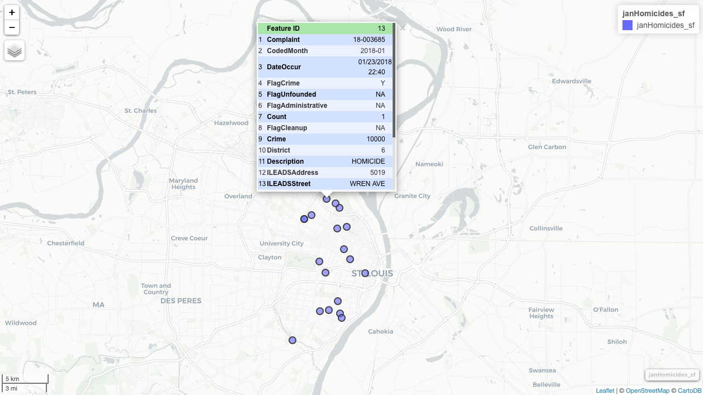

<!-- README.md is generated from README.Rmd. Please edit that file -->

```{r, echo = FALSE}
knitr::opts_chunk$set(
  collapse = TRUE,
  comment = "#>",
  fig.path = "README-"
)
```

# compstatr 
[](https://www.tidyverse.org/lifecycle/#maturing)
[](https://travis-ci.org/slu-openGIS/compstatr)
[](https://ci.appveyor.com/project/chris-prener/compstatr)
[](https://codecov.io/github/slu-openGIS/compstatr?branch=master)
[](https://zenodo.org/badge/latestdoi/105331568)
[](https://cran.r-project.org/package=compstatr)

The goal of `compstatr` is to provide a suite of tools for working with crime data made public by the City of St. Louis' [Metropolitan Police Department](http://www.slmpd.org).

## Motivation
Among cities in the United States, St. Louis has the distinction of having the highest or one of the highest violent crime and homicide rates since 2010. It therefore presents an important site for social scientists, public health researchers, and health care providers as well as policy makers to understand the effects of violent crime on urban communities. 

The City's crime data, however, are difficult to work with and present a number of challenges for researchers. These data are inconsistently organized, with all data before 2013 and some months of 2013 itself having eighteen variables. Beginning during 2013, most (but not all) months have twenty variables, many of which are named differently from their pre-2014 counterparts. These inconsistencies, and the fact that working with their data requires managing over 120 spreadsheets that each download with with a `.html` file extension, are the motivating force behind `compstatr`.

We therefore provide a set of tools for accessing, preparing, editing, and mapping St. Louis [Metropolitan Police Department](http://www.slmpd.org) (SLMPD) crime data, which are available [on their website](http://www.slmpd.org/Crimereports.shtml) as `.csv` files. The categorization tools that are provided will work with any police department that uses 5 and 6 digit numeric codes to identify specific crimes.

## What's New?
### Latest GitHub
The current GitHub version contains a bug fix, not available on CRAN yet, that addresses a failure where the categorize and filter functions don't to work properly if the `var` column is not integer.

## Installation
The easiest way to get `compstatr` is to install it from CRAN:

``` r
install.packages("compstatr")
```

The development version of `compstatr` can be accessed from GitHub with `remotes`:

```r
# install.packages("remotes")
remotes::install_github("slu-openGIS/compstatr")
```

## Usage
We'll start with loading the `compstatr` package:

```r
> library(compstatr)
```

### Data Access - Read Tables Directly into R
As of version `v0.2.0`, data tables can be scraped and read directly into `R` without manually downloading them first. They are read from the St. Louis Metropolitan Police Department's [website](http://www.slmpd.org/Crimereports.shtml) and imported directly as objects in `R`'s global environment. To identify the last available month: 

```r
> cs_last_update()
[1] "May 2019"
```

To enable scraping, an index of the available data needs to be created. Doing this is optional but highly recommended to improve performance:

```r
> # create index
> i <- cs_create_index()
```

This index is used by `cs_get_data()` to find the requested table or tables, post a request via the SLMPD website's form system, and then download your data:

```r
> # download single month
> may17 <- cs_get_data(year = 2017, month = "May", index = i)
>
> # download full year
> yearList17 <- cs_get_data(year = 2017, index = i)
```

Once data are downloaded, they need to be validated and standardized before proceeding with analysis.

### Data Access - Use Tables Downloaded Manually
While scraping is now an option, St. Louis data can still be downloaded month-by-month from [SLMPD](http://www.slmpd.org/Crimereports.shtml). `compstatr` assumes that only one year of crime data (or less) is included in specific folders within your project. These next examples assume you have downloaded all of the data for 2017 and 2018, and saved them respectively in `data/raw/2017` and `data/raw/2018`. 

The function `cs_prep_data()` can be used to rename files, which may be downloaded with the wrong file extension (`January2018.csv.html`). Once downloaded you can load them into what we call year-list objects:

```r
> cs_prep_year(path = "data/raw/2017")
>
> yearList17 <- cs_load_year(path = "data/raw/2017")
```

Once data are downloaded, they need to be validated and standardized before proceeding with analysis.

### Data Preparation
Both the data downloaded manually as well as the tables scraped from SLMPD's website are inconsistently organized. Problems that need to be addressed prior to collapsing a year-list into a single object can be identified with `cs_validate()`:

```r
> cs_validate(yearList17, year = 2017)
[1] FALSE
```

If a `FALSE` value is returned, the `vebose = TRUE` argument provides additional detail:

```r
> cs_validate(yearList17, year = 2017, verbose = TRUE)
# A tibble: 12 x 8
   namedMonth codedMonth valMonth codedYear valYear oneMonth varCount valVars
   <chr>      <chr>      <lgl>        <int> <lgl>   <lgl>    <lgl>    <lgl>  
 1 January    January    TRUE          2017 TRUE    TRUE     TRUE     TRUE   
 2 February   February   TRUE          2017 TRUE    TRUE     TRUE     TRUE   
 3 March      March      TRUE          2017 TRUE    TRUE     TRUE     TRUE   
 4 April      April      TRUE          2017 TRUE    TRUE     TRUE     TRUE   
 5 May        May        TRUE          2017 TRUE    TRUE     FALSE    NA     
 6 June       June       TRUE          2017 TRUE    TRUE     TRUE     TRUE   
 7 July       July       TRUE          2017 TRUE    TRUE     TRUE     TRUE   
 8 August     August     TRUE          2017 TRUE    TRUE     TRUE     TRUE   
 9 September  September  TRUE          2017 TRUE    TRUE     TRUE     TRUE   
10 October    October    TRUE          2017 TRUE    TRUE     TRUE     TRUE   
11 November   November   TRUE          2017 TRUE    TRUE     TRUE     TRUE   
12 December   December   TRUE          2017 TRUE    TRUE     TRUE     TRUE   
```

In this case, we have the wrong number of variables for the month of May (in this case there are 26). We can fix this by using `cs_standardize()` to create the correct number of columns (20) and name them appropriately:

```r
> # standardize 
yearList17 <- cs_standardize(yearList17, month = "May", config = 26)
>
> # confirm data are now valid
> cs_validate(yearList17, year = 2017)
[1] TRUE
```

For 2013 and prior years, there will be only 18 variables. The 2013 data need to be fixed month by month because there are some correct months, but years 2008 through 2012 can be fixed en masse:

```r
> yearList08 <- cs_standardize(yearList08, config = 18, month = "all")
```

Once the data have been standardized, we can collapse them into a single object with `cs_collapse()`:

```r
> reports17 <- cs_collapse(yearList17)
```

This gives us all of the crimes reported in 2017. However, there will be crimes that were reported that year that occurred in prior years, and there may also be crimes reported in 2018 that took place in our year of interest. We can address both issues (assuming we have the next year's data) with `cs_combine()`:

```r
> # load and standardize 2018 data
> cs_prep_year(path = "data/raw/2018")
> yearList18 <- cs_load_year(path = "data/raw/2018")
> cs_validate(yearList18, year = 2018)
[1] TRUE
> reports18 <- cs_collapse(yearList18)
>
> # combine 2017 and 2018 data
crimes17 <- cs_combine(type = "year", date = 2017, reports17, reports18)
```

We now have a tibble containing all of the known crimes that occurred in 2017 (including those reported in 2018).

### Data Wrangling and Mapping
Once we have the data prepared, we can easily pull out a specific set of crimes to inspect further. For example, we could identify homicides. In the next few examples, we'll use the `january2018` example data that comes with the package. We'll start by using `cs_filter_crimes()` to select only homicides as well as `cs_filter_count()` to remove any unfounded incidents:

```r
> # load dependencies
> library(compstatr)
> library(ggplot2)
> library(magrittr)
> library(mapview)
> 
> # subset homicides and removed unfounded incidents
> janHomicides <- january2018 %>%
+   cs_filter_count(var = Count) %>%
+   cs_filter_crime(var = Crime, crime = "homicide")
```

Next, we'll check for missing spatial data with `cs_missingXY()`:

```r
> # identify missing spatial data
> janHomicides <- cs_missingXY(janHomicides, varX = XCoord, varY = YCoord, newVar = missing)
> 
> # check for any TRUE values
> table(janHomicides$missing)
```

We don't have any missing spatial data in this example, but if we did we would need to remove those observations with `dplyr::filter()` (or another subsetting tool). Finally, we can project and map our data:

```r
> # project data
> janHomicides_sf <- cs_projectXY(janHomicides, varX = XCoord, varY = YCoord)
> 
> # preview data
> mapview(janHomicides_sf)
```
```{r exampleMap1, echo=FALSE, out.width = '100%'}

```

These data can also be mapped using `ggplot2` once they have been projected:

```r
> library(ggplot2)
> ggplot() + 
+   geom_sf(data = janHomicides_sf, color = "red", fill = NA, size = .5)
```
```{r exampleMap2, echo=FALSE, out.width = '40%'}
knitr::include_graphics("man/figures/homicide_map.png")
```

## Non St. Louis Data
If you work with data from other police departments, the `cs_crime()`, `cs_crime_cat()`, and `cs_filter_crime()` functions may be useful for identifying, grouping, and subsetting by crime so long as they use a standard set of 5 and 6 digit codes based on the UCR system (e.g. `31111` (robbery with a firearm) or `142320` (malicious destruction of property)).

## Acknowledgements
We wish to thank Taylor Braswell for his significant efforts compiling Stata code early in this project. Taylor's code was used as a reference when developing this package, and many of the functions reflect issues that he worked to identify.

## Contributor Code of Conduct
Please note that this project is released with a [Contributor Code of Conduct](https://github.com/slu-openGIS/compstatr/blob/master/.github/CODE_OF_CONDUCT.md). By participating in this project you agree to abide by its terms.
